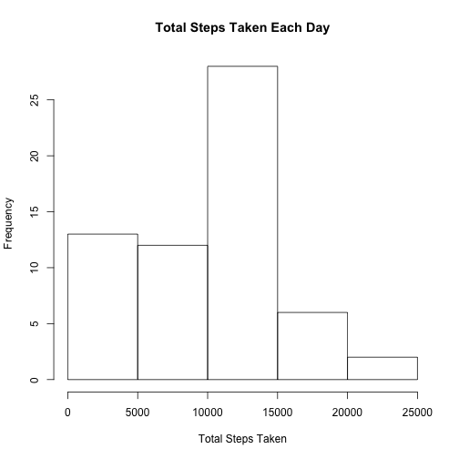
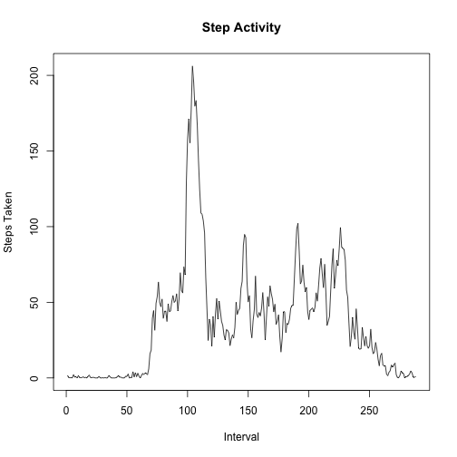
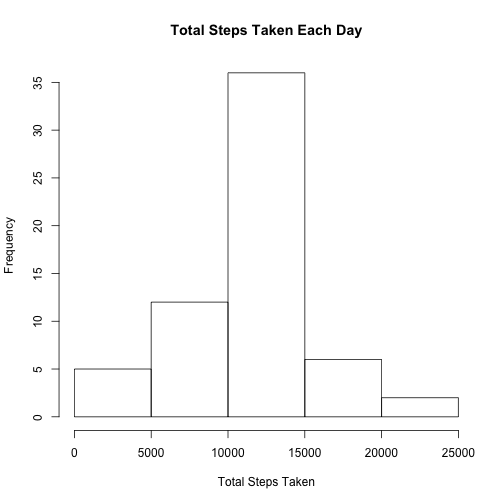

  
  
## Loading and preprocessing the data

```r
original_data <- read.csv("activity.csv")
```


## What is mean total number of steps taken per day?
The total number of steps taken per day is 

```r
total_steps <- tapply(as.numeric(original_data$steps), original_data$date, sum, na.rm = TRUE)
kable(total_steps)
```

```
## Error in dn[[2L]]: subscript out of bounds
```


A histogram of the daily activity:

```r
hist(total_steps, main = "Total Steps Taken Each Day", xlab = "Total Steps Taken")
```

 

There were an average of 9354.2295082 steps taken per day.
The median steps taken per day was 1.0395 &times; 10<sup>4</sup>.


## What is the average daily activity pattern?

```r
plot_data <- data.frame(tapply(as.numeric(original_data$steps), as.numeric(original_data$interval), mean, na.rm = TRUE))
plot_data <- cbind(row.names(plot_data), plot_data)
colnames(plot_data) <- cbind("interval", "average_steps")
plot(plot_data$average_steps, type = "l", main = "Step Activity", xlab = "Interval", ylab = "Steps Taken")
```

 

The interval with the highest average, as seen in the chart, is 835.


## Imputing missing values
There are 2304 missing values in the data set.
To deal with this, I will replace all 'NA' values with the mean value for all non-NA values per 5-minute interval per day.


```r
new_steps_col <- vector()
mean_interval_steps <- mean(plot_data$average_steps)
for (i in 1:length(original_data$steps)) {
  new_steps <- (if(is.na(original_data[i,"steps"]))  mean_interval_steps
                else original_data[i,"steps"])
  
  new_steps_col <- rbind(new_steps_col, new_steps)
}

new_data <- original_data
new_data$steps <- new_steps_col
new_data$date <- as.Date(new_data$date)
total_steps_new <- tapply(as.numeric(new_data$steps), new_data$date, sum, na.rm = TRUE)
hist(total_steps_new, main = "Total Steps Taken Each Day", xlab = "Total Steps Taken")
```

 

There were an average of 1.0766189 &times; 10<sup>4</sup> steps taken per day.
The median steps taken per day was 1.0766189 &times; 10<sup>4</sup>.

The impact of the missing data was minimal, but shifted the distribution of steps per day upward, particularly for the lowest quintile of the histogram.

## Are there differences in activity patterns between weekdays and weekends?

```r
weekday <- weekdays(new_data$date)
weekend <- factor(as.numeric(weekday == "Saturday" | weekday == "Sunday"), labels = c("weekday", "weekend"))
new_data <- cbind(new_data, weekend)
```
